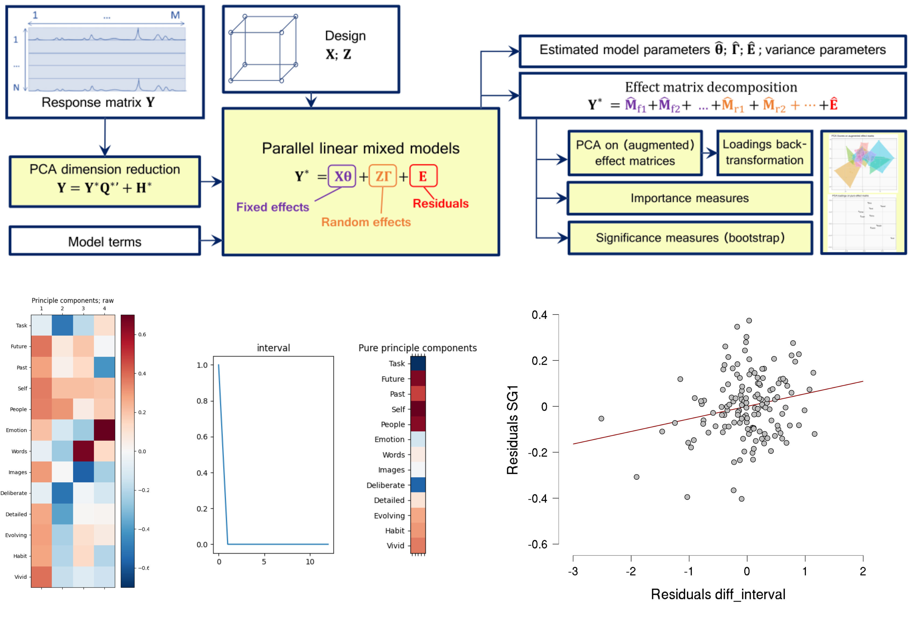

# Linear mixed model augmented PCA reveal ongoing thought pattern associated with large scale gradient

H-T Wang[1], B Mckeown[2], WH Strawson[3], J Smallwood[4]

[1] Sackler Centre for Consciousness Science, Brighton and Sussex Medical School, University of Sussex, UK [2] Department of Psychology, University of York, UK [3] Department of Psychology,  University of Sussex, UK [4] Department of Psychology, Queen's University, Canada

## Introduction

Analysis of high dimensional omics data with advanced data contextual structure can be challenging. Principal component analysis provides a simple, unsupervised approach to simplify and model the correlation in the data. However, there is no assurance that it will give a clear insight into the influence of the factors if unwanted nuisance factors are the main sources of variability. In the field of chemometrics, researchers developed combined approaches of dimension reduction and classical statistical modelling. It enables deciphering the main sources of variability with GLM or linear mixed model and preserving the graphical representations of the PCA factors' effect(Martin & Govaerts, 2020). The current study provides a reanalysis of experience sampling data during an n-back test (Wang et al., 2018) to showcase the hybrid approach. We explore if the augmented PCA pattern of ongoing thought can provide a better regression model fit than the raw PCA scores.

## Methods

Resting-state scan and mind wandering reports were acquired from 197 participants (126 females, 71 males; age range = 18-31 years, M = 20.11, SD = 2.24). The experience-sampling measures accessed during a 0-back/1-back working memory task. Principal component analysis was performed on experience sampling probes. A linear mixed model with conditions (0-/1-back) and probe-task interval (time between a thought probe and the most recent action-required event)(Turnbull et al., 2019) as fixed effects and subject as a random effect were fitted to create the augmented PCA patterns. We employed the BrainSpace toolbox to calculate the dimensions that characterize the functional connectivity of the brain at rest. Regression models were fitted to quantify the relationship between the RSFC pattern and ongoing thought patterns with gender, age, and average movement as part of the null model. 

## Results

LiMM-PCA showed more than 30% of the original PCA pattern was explained by residual. Pattern explained by the n-back task design was under 5%. However the augmented PCA pattern of task-probe interval has shown significant relation with the principle gradient (full model: F(4, 137)=2.50, p=0.046; univariate term: b=0.05, t = 2.60, p = 0.01, 95%CI[0.01, 0.10]) and performed better than the null model (Fchange(1, 137)=6.78. p=0.01). No PCA factor for the original PCA yields any significant model.

Top: Schematic of LiMM-PCA from Martin and Govaerts, 2020 (Martin & Govaerts, 2020); Bottom left: raw PCA pattern of ongoing thought; Bottom middle: augmented PCA pattern explained by task-probe interval; Bottom right: difference of augment interval factor correlating with the principle gradient

## Conclusions
LiMM-PCA yields context specific principle components of ongoing thought that predicts functional connectivity patterns better than the original original principal components, providing more contextual detail to explain the neurocognitive relationship of the principal gradient. However, with a complex model, permutation tests will be needed to further confirm the validity of our result. There’s potential to apply LiMM-PCA to functional connectivity measures under more complex circumstances, such as dynamic connectivity during task fMRI scans.

## References
Martin, M., & Govaerts, B. (2020). LiMM‐PCA: Combining ASCA and linear mixed models to analyse high‐dimensional designed data. In Journal of Chemometrics (Vol. 34, Issue 6). https://doi.org/10.1002/cem.3232

Turnbull, A., Wang, H.-T., Schooler, J. W., Jefferies, E., Margulies, D. S., & Smallwood, J. (2019). The ebb and flow of attention: Between-subject variation in intrinsic connectivity and cognition associated with the dynamics of ongoing experience. NeuroImage, 185, 286–299.

Wang, H.-T., Poerio, G., Murphy, C., Bzdok, D., Jefferies, E., & Smallwood, J. (2018). Dimensions of Experience: Exploring the Heterogeneity of the Wandering Mind. Psychological Science, 29(1), 56–71.

## Acknowledgements
H-T Wang is funded by the Sackler foundation. The data was collected with support from ERC and at York Neuroimaging Centre 2015 - 2019.
